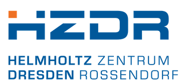

(development:about-uqtestfuns)=
# About the UQTestFuns Project

UQTestFuns is an homage to the
[Virtual Library of Simulation Experiments: Test Functions and Datasets] (VLSE).

For many years this site has been very useful in providing
the uncertainty quantification (UQ) community 
with test functions and datasets from the literature.
It is very well organized, describing each of the test functions
briefly but clearly, and making proper citations to the sources
of the test functions.
It even includes implementations both in MATLAB and R.

But it has been a long time since the site was updated,
and it is not very clear how other people can contribute to the site,
say, to add a new test function or an implementation in languages 
other than MATLAB and R.

For instance, we are currently developing a software package written in Python
that is hopefully relevant to the UQ community.
For testing, we find ourselves reimplementing the test functions
and the corresponding input specification in Python.
Indeed, many UQ tools (in Python or other languages) include
a subset of the test functions
available in [VLSE] for testing, benchmarking, and illustration purposes.

Instead of doing the same thing, we opted to distribute the collection of
the test functions we have implemented as a Python package 
with a consistent interface.
The package can then be installed and imported as needed
by other packages (including our own) for testing and benchmarking purposes.

Test functions in applied UQ are unique due to the specifications of the input
as random variables.
In UQTestFuns, the input specification is an integral part of all the available
test functions.
With a common interface, realizations from probabilistic inputs can be
conveniently generated or transformed from and to the domain of the function.

The package documentation, available online, serves as
a library of UQ test functions similar to the [VLSE]
(but with implementations in Python).
While it may not always be possible, we also try to include
the relevant reference values for common UQ analyses
(e.g., metamodeling, sensitivity analysis, moments estimation error)
associated with the test functions available in the literature.

As an open-source project, UQTestFuns tries to provide clear guidance for all 
on how to contribute to it, fixing broken things, and adding new stuff&mdash;be
it a new test function, new reference values, or a better description.

We hope UQTestFuns can be useful for the UQ community,
just as the [VLSE] has been very useful to us.

## About us

UQTestFuns is developed and maintained by a small team at the Center for
Advanced Systems Understanding ([CASUS][CASUS_]),
an institute of the Helmholtz-Zentrum Dresden-Rossendorf ([HZDR](https://www.hzdr.de/)).

::::{grid}
:padding: 5

:::{grid-item}
[](https://www.casus.science/)
:::
:::{grid-item}
[](https://www.hzdr.de/)
:::

::::

### Project maintainers

Project maintainers are the current main developers responsible for UQTestFuns
and managing its development process.

::::{grid}
:padding: 1

:::{grid-item}
[](https://www.github.com/damar-wicaksono)
</br>
Damar Wicaksono
:::
::::

### Scientific direction and funding

These individuals provide input on the scientific direction of the project
or help attract and secure funding for the research.

::::{grid}
:padding: 1

:::{grid-item}
[](https://sites.google.com/view/prof-dr-michael-hecht/home)
</br>
Michael Hecht
:::
::::

## Sponsors

The Minterpy project is partly funded by the Center for Advanced Systems Understanding
([CASUS][CASUS_]) which is financed by Germany's Federal Ministry of Education and Research
([BMBF][BMBF_]) and by the Saxony Ministry for Science, Culture and Tourism
([SMWK][SMWK_]).
Funding is provided through tax funds based on the budget approved
by the Saxony State Parliament.

::::{grid}
:gutter: 2

:::{grid-item}
```{image} ../assets/BMBF.png
:alt: BMBF
:width: 250px
:align: left
```
:::
:::{grid-item}
:padding: 5 0 0 0
```{image} ../assets/SWKT.png
:alt: SWKT
:width: 275px
:align: left
```
:::

::::


[Virtual Library of Simulation Experiments: Test Functions and Datasets]: https://www.sfu.ca/~ssurjano/
[VLSE]: https://www.sfu.ca/~ssurjano/
[CASUS_]: https://www.casus.science/
[BMBF_]: https://www.bmbf.de/bmbf/en/home/home_node.html
[SMWK_]: https://www.smwk.sachsen.de